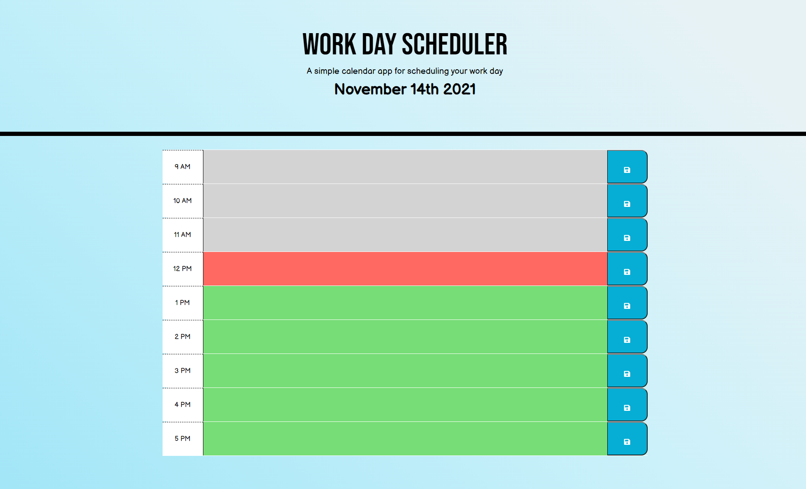

# Workday Scheduler 

## Purpose
This workday scheduler provides a place to keep track of daily events to help you keep track of your busy schedule and manage your time effectively.

## Acceptance Criteria
- current day is displayed at the top of the calendar
- time blocks for standard business hours
- each time block is color-coded to indicate whether it is in the past, present, or future
- input events into time blocks
- events are saved in local storage and persist when page is refreshed

## Built With
- HTML
- CSS
- JavaScript

## Webpage 
[This is an external link to published site] (https://acdodd17.github.io/work-day-schedule/)

## Wepage Application Appearance

## Contirbution
Made by Anna Dodd 